# Autopilot: GRAPH Mode
# Project Autopilot - Dependency visualization
# Copyright (c) 2026 Jeremy McSpadden <jeremy@fluxlabs.net>

Generate visual dependency graphs showing phase relationships, critical path, and current progress.

## Required Skills

**Read before generating:**
1. `/autopilot/skills/dependency-visualization/SKILL.md` - Graph generation rules
2. `/autopilot/skills/phase-ordering/SKILL.md` - Dependency definitions

## Required Agents

- `graph-builder` - Generate dependency graphs

---

## Options

| Option | Description |
|--------|-------------|
| `--format=mermaid\|ascii\|dot` | Output format (default: mermaid) |
| `--output=path` | Write to file (default: stdout) |
| `--highlight=X` | Highlight mode (critical\|status\|none) |
| `--include-tasks` | Include task-level dependencies |
| `--show-costs` | Include cost estimates in nodes |

---

## Behavior

```
FUNCTION graph(options):

    # 1. Verify project exists
    IF NOT exists(".autopilot/"):
        ERROR "No project found. Run /autopilot:takeoff (auto-creates plan) or /autopilot:flightplan first."
        RETURN

    # 2. Load phase data
    roadmap = readFile(".autopilot/roadmap.md")
    phases = glob(".autopilot/phases/*.md")
    state = readFile(".autopilot/STATE.md")

    # 3. Build dependency graph
    graph = SPAWN graph-builder → buildGraph({
        phases: extractPhases(phases),
        dependencies: extractDependencies(roadmap),
        currentPhase: extractCurrentPhase(state),
        format: args.format,
        highlight: args.highlight,
        includeTasks: args.includeTasks,
        showCosts: args.showCosts
    })

    # 4. Output
    IF args.output:
        writeFile(args.output, graph)
        LOG "Graph written to {args.output}"
    ELSE:
        DISPLAY graph
```

---

## Output Formats

### Mermaid (Default)

Embeddable in markdown, renders in GitHub/GitLab:

```mermaid
graph TD
    subgraph "Project: Task Management API"
    P001[001: Setup<br/>$0.15 ✅]
    P002[002: Database<br/>$0.32 ✅]
    P003[003: Auth<br/>$0.45 ✅]
    P004[004: API<br/>$0.85 🔄]
    P005[005: Business<br/>$1.10 ⏳]
    P006[006: Frontend<br/>$1.40 ⏳]
    P007[007: Testing<br/>$0.65 ⏳]
    P008[008: Security<br/>$0.40 ⏳]
    P009[009: Docs<br/>$0.35 ⏳]
    P010[010: DevOps<br/>$0.50 ⏳]
    end

    P001 --> P002
    P001 --> P003
    P002 --> P004
    P003 --> P004
    P004 --> P005
    P005 --> P006
    P005 --> P007
    P006 --> P007
    P007 --> P008
    P008 --> P009
    P008 --> P010

    style P001 fill:#90EE90
    style P002 fill:#90EE90
    style P003 fill:#90EE90
    style P004 fill:#FFD700
    style P005 fill:#E0E0E0
    style P006 fill:#E0E0E0
    style P007 fill:#E0E0E0
    style P008 fill:#E0E0E0
    style P009 fill:#E0E0E0
    style P010 fill:#E0E0E0
```



### Mermaid with Critical Path Highlight


### ASCII (Terminal-friendly)

```
                    ┌─────────────┐
                    │ 001: Setup  │
                    │   $0.15 ✅   │
                    └──────┬──────┘
                           │
              ┌────────────┼────────────┐
              ▼            │            ▼
      ┌───────────────┐    │    ┌───────────────┐
      │ 002: Database │    │    │   003: Auth   │
      │   $0.32 ✅     │    │    │   $0.45 ✅     │
      └───────┬───────┘    │    └───────┬───────┘
              │            │            │
              └────────────┼────────────┘
                           ▼
                   ┌───────────────┐
                   │   004: API    │
                   │   $0.85 🔄    │
                   └───────┬───────┘
                           │
                           ▼
                   ┌───────────────┐
                   │ 005: Business │
                   │   $1.10 ⏳    │
                   └───────┬───────┘
                           │
              ┌────────────┼────────────┐
              ▼            │            ▼
      ┌───────────────┐    │    ┌───────────────┐
      │ 006: Frontend │    │    │ 007: Testing  │
      │   $1.40 ⏳     │    │    │   $0.65 ⏳     │
      └───────┬───────┘    │    └───────┬───────┘
              │            │            │
              └────────────┼────────────┘
                           ▼
                   ┌───────────────┐
                   │ 008: Security │
                   │   $0.40 ⏳    │
                   └───────┬───────┘
                           │
              ┌────────────┴────────────┐
              ▼                         ▼
      ┌───────────────┐         ┌───────────────┐
      │  009: Docs    │         │ 010: DevOps   │
      │   $0.35 ⏳     │         │   $0.50 ⏳     │
      └───────────────┘         └───────────────┘

Legend: ✅ Complete | 🔄 In Progress | ⏳ Pending
Critical Path: 001 → 002 → 004 → 005 → 006 → 007 → 008 → 010
```

### DOT (Graphviz)

For rendering with Graphviz tools:


---

## Critical Path Analysis

The graph highlights the critical path - the longest sequence of dependent phases that determines minimum project duration.

```markdown
## Critical Path Analysis

**Critical Path:** 001 → 002 → 004 → 005 → 006 → 007 → 008 → 010
**Path Length:** 8 phases
**Estimated Duration:** $5.37 (minimum)

### Bottlenecks

| Phase | Blocks | Impact |
|-------|--------|--------|
| 004: API | 5 phases | High - most downstream dependencies |
| 005: Business | 4 phases | High - blocks frontend and testing |
| 008: Security | 2 phases | Medium - near end of chain |

### Parallelization Opportunities

| Phases | Can Run Together | Combined Est. |
|--------|------------------|---------------|
| 002, 003 | Yes (both need 001) | $0.77 → parallel |
| 006, 007 | Partial (007 needs 006) | Sequential |
| 009, 010 | Yes (both need 008) | $0.85 → parallel |

### Optimization Recommendations

1. **Prioritize Phase 004** - Most phases depend on it
2. **Parallelize 002 + 003** - Save ~$0.32 worth of time
3. **Parallelize 009 + 010** - Save ~$0.35 worth of time
```

---

## Task-Level Graph (--include-tasks)

Show dependencies within phases:


---

## Quick Start Examples

```bash
# Generate mermaid diagram
/autopilot:graph

# Save to file for README
/autopilot:graph --output=docs/dependency-graph.md

# ASCII for terminal viewing
/autopilot:graph --format=ascii

# Highlight critical path
/autopilot:graph --highlight=critical

# Include task-level detail
/autopilot:graph --include-tasks

# DOT format for Graphviz
/autopilot:graph --format=dot --output=graph.dot
dot -Tpng graph.dot -o graph.png

# Show costs in nodes
/autopilot:graph --show-costs

# Full detail for documentation
/autopilot:graph --format=mermaid --show-costs --highlight=status --output=ROADMAP.md
```

---

## Embedding in README

Add this to your project README:

````markdown
## Project Roadmap

```mermaid
graph TD
    P001[Setup ✅] --> P002[Database ✅]
    P001 --> P003[Auth ✅]
    P002 --> P004[API 🔄]
    P003 --> P004
    P004 --> P005[Business ⏳]
    ...
```



*Generated with `/autopilot:graph`*
````

---

## No Project Found

If `.autopilot/` doesn't exist:

```markdown
## Error: No Project Found

No Autopilot project exists in this directory.

**Start a project:**
```bash
/autopilot:takeoff "Your feature description"
```

Then generate the dependency graph:
```bash
/autopilot:graph
```
```

$ARGUMENTS
